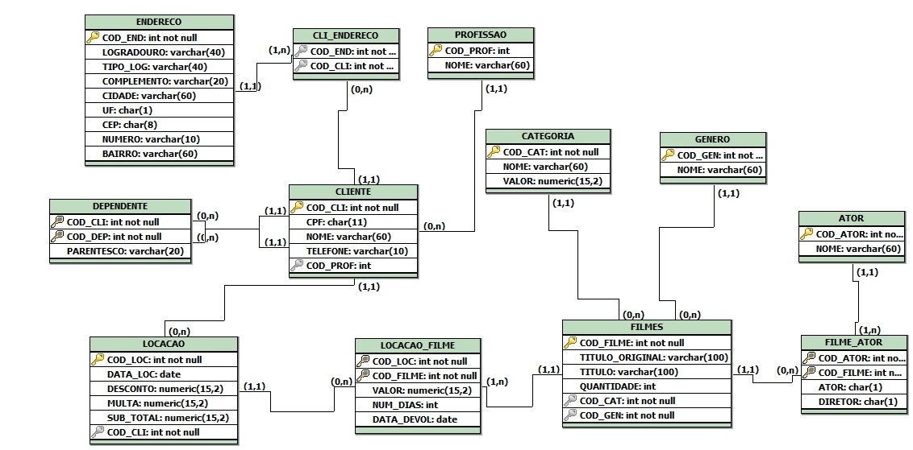

# Aplicação Avaliativa da Academia Java - Locadora de Filmes

Este projeto é uma aplicação desenvolvida como parte de uma avaliação da Academia Java. A aplicação simula um sistema de gerenciamento de uma locadora de filmes, incluindo a criação do banco de dados e a inserção de dados iniciais.
Segue o diagrama:

Além disso, implementa diversas consultas SQL para manipulação e análise dos dados.

## Funcionalidades Implementadas

1. **Listar todos os filmes alugados por um cliente específico**

   - Inclui a data de locação e a data de devolução.

2. **Obter uma lista de clientes e seus dependentes**

3. **Listar todos os filmes de um determinado gênero**

4. **Exibir todos os clientes que têm uma profissão específica**

5. **Encontrar todos os filmes em uma categoria específica com quantidade disponível maior que 5**

6. **Listar todos os atores que participaram de filmes com um determinado título**

7. **Obter o endereço completo de um cliente específico**

8. **Listar todos os filmes e seus respectivos gêneros e categorias**

9. **Mostrar todos os clientes que alugaram um filme específico e a data de locação**

10. **Exibir a lista de clientes com multas superiores a um valor específico**

11. **Listar todas as locações feitas em um período específico**

12. **Obter a quantidade total de filmes alugados por cada cliente** _(Desafio)_

13. **Listar os clientes e os filmes que eles alugaram, ordenados por data de locação**

14. **Mostrar todos os clientes que moram em uma cidade específica e que alugaram filmes de uma categoria específica**

15. **Encontrar todos os atores que participaram de pelo menos 5 filmes**

    - Listando o nome do ator e o número de filmes em que atuou _(Desafio)_

16. **Exibir a quantidade total de filmes alugados por categoria e gênero**
    - Incluindo apenas as categorias e gêneros que têm mais de 5 filmes alugados no total _(Desafio)_
